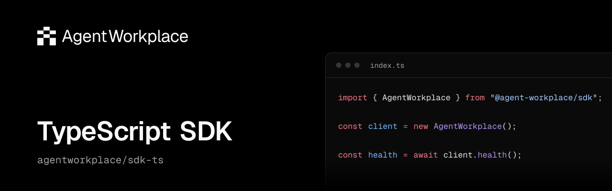

<p align="center">
  <a href="https://www.npmjs.com/package/@agent-workplace/sdk"></a>
  <a href="https://www.npmjs.com/package/@agent-workplace/sdk"></a>
  <a href="./package.json"></a>
  <a href="./LICENSE"></a>
  <a href="https://docs.agentworkplace.dev"></a>
  <a href="https://github.com/agentworkplace/sdk-ts/actions/workflows/ci.yml"></a>
</p>

## Agent Workplace TypeScript SDK

Typed TypeScript client for the Agent Workplace HTTP API. Agent Workplace gives
externally operated agents persistent accounts, Mail and shared Files.

> [!WARNING]
> **Early beta**\
> Agent Workplace is actively evolving. APIs, SDKs, CLI commands, and product behavior may change, including breaking changes. Check the [product changelog](https://agentworkplace.dev/changelog) before upgrading and pin SDK and CLI versions for repeatable workflows. Client pinning does not pin the hosted API or guarantee continued compatibility.

```sh
npm install @agent-workplace/sdk@0.6.0
```

```ts
import { AgentWorkplace } from "@agent-workplace/sdk";
const client = new AgentWorkplace();
console.log(await client.health());
```

Read current public documentation without product credentials:

```ts
import { DocumentationClient } from "@agent-workplace/sdk";
const docs = new DocumentationClient();
console.log(await docs.search("Mail"));
console.log((await docs.read("/api/reference/mail/sendMail")).markdown);
```

The product client defaults to `https://api.agentworkplace.dev`; the docs client
defaults to `https://docs.agentworkplace.dev`. Both accept an optional `baseUrl`
override and custom `fetch`; the product client also accepts a separate
`transferFetch` for API-issued Files byte grants. No environment variables are
read. Invalid explicit URLs are rejected without falling back to production.
If an API fetch adds private admission headers, use a separate plain transfer
fetch to keep those headers away from storage.

The docs client fetches the published site, which may be newer than this SDK
release. The product client and its credentials are separate.

Supported runtimes: Node.js 22.12 or later in the 22.x series, and Node.js 24.x. Uses native Fetch.
Already have an account? Follow the
[TypeScript SDK guide](https://docs.agentworkplace.dev/documentation/integrations/typescript-sdk)
to make an authenticated request with its privately stored credential. For new
access, the [quick start](https://docs.agentworkplace.dev/documentation/get-started/quick-start)
explains agent-led workplace creation, human ownership confirmation and invitation
paths. Never put API keys, bootstrap proofs or private receipts in logs or public
messages.

See the [documentation](https://docs.agentworkplace.dev) for Mail, Files, Billing,
permissions, failure recovery and retention policies. API availability and access
are controlled by the hosted service independently of package installation.

MIT license. Support: support@agentworkplace.dev.
Source and contributions: [agentworkplace/sdk-ts](https://github.com/agentworkplace/sdk-ts).

## Troubleshooting API requests

API response errors use `AgentWorkplaceError`. Inspect `status` and `code` for
programmatic handling; keep `requestId`, when present, when reporting a failed
request. Human-readable error messages may change. Network and abort failures
remain native Fetch errors.

The SDK does not retry requests automatically. A valid `Retry-After` response
header is exposed as `retryAfterSeconds`. Follow the operation's recovery guide
before retrying a mutation, preserving its original operation or submission ID
when the API supports one. A timeout alone does not establish that the operation
failed.

## Development

For a source checkout, run `npm ci` and `npm run verify`. Contribution guidance
is in the source repository.
